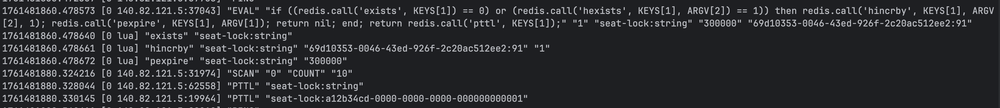
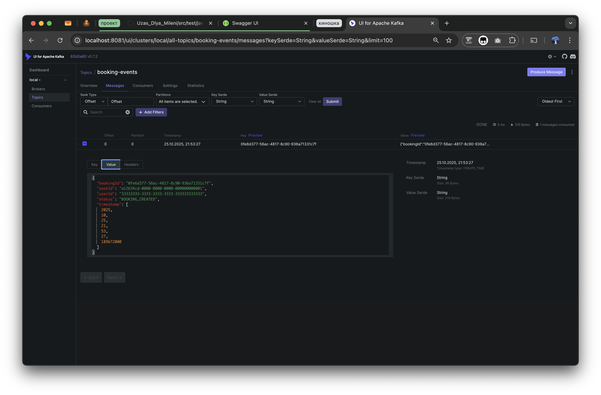
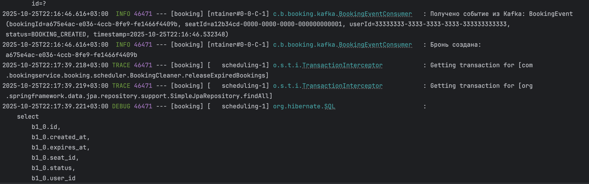
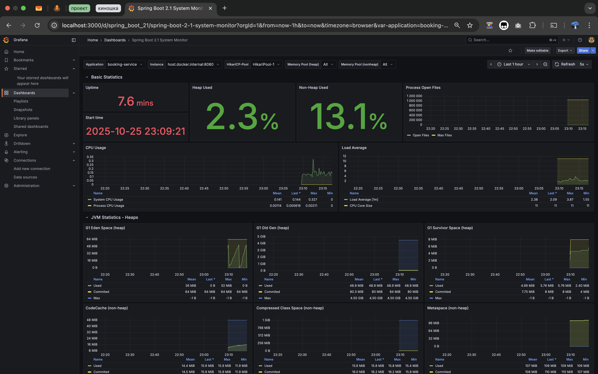
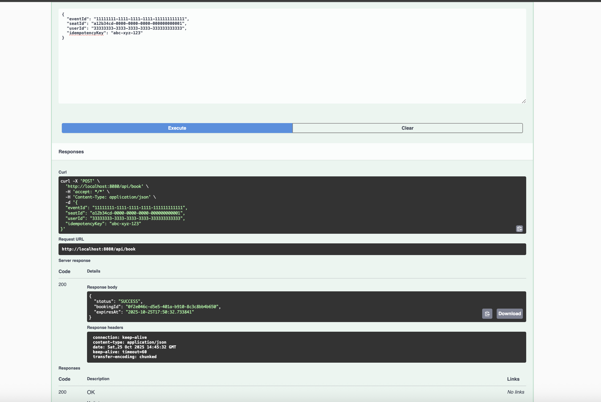
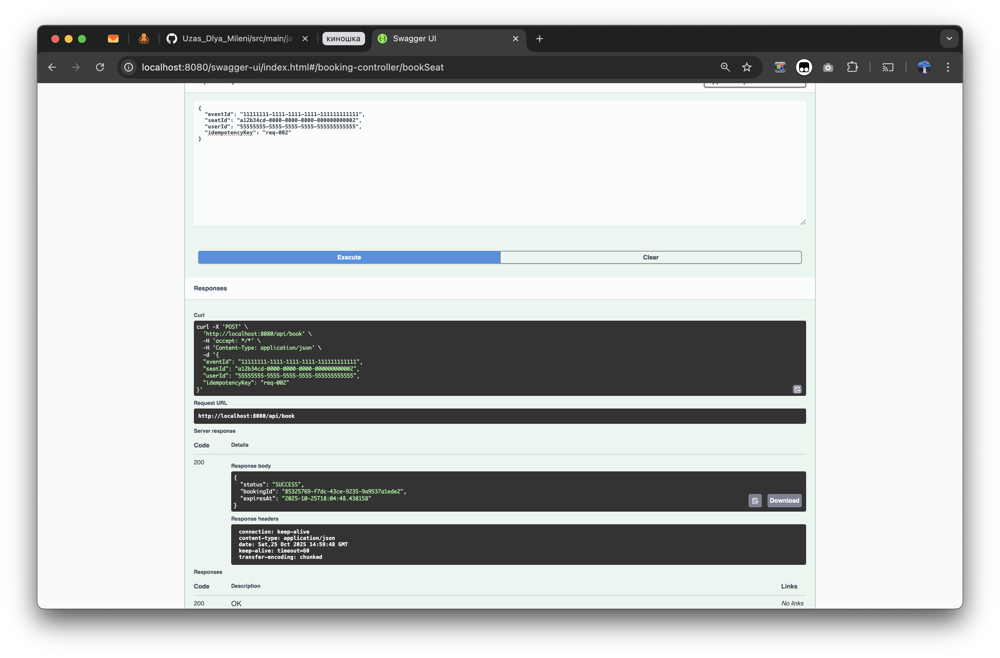
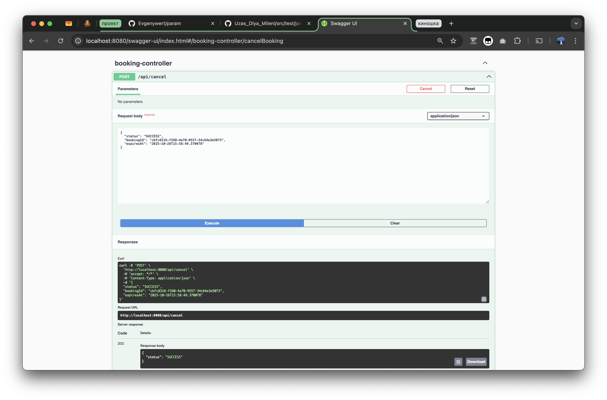
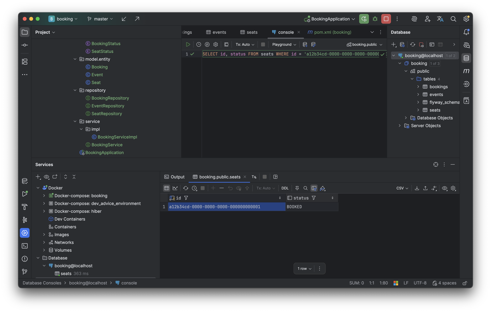
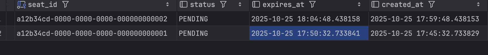

```
▗▄▄▖  ▗▄▖  ▗▄▖ ▗▖ ▗▖▗▄▄▄▖▗▖  ▗▖ ▗▄▄▖
▐▌ ▐▌▐▌ ▐▌▐▌ ▐▌▐▌▗▞▘  █  ▐▛▚▖▐▌▐▌   
▐▛▀▚▖▐▌ ▐▌▐▌ ▐▌▐▛▚▖   █  ▐▌ ▝▜▌▐▌▝▜▌
▐▙▄▞▘▝▚▄▞▘▝▚▄▞▘▐▌ ▐▌▗▄█▄▖▐▌  ▐▌▝▚▄▞▘
```


#   Booking Service — сервис бронирования мест

[](https://openjdk.org/)
[](https://spring.io/projects/spring-boot)
[](https://www.postgresql.org/)
[](https://redis.io/)
[](https://kafka.apache.org/)
[](https://docs.docker.com/compose/)

---

##  О проекте

**Booking Service** — который гарантирует,
что одно место может быть забронировано **только одним пользователем одновременно**.  
Используются:
- **Redis (Redisson)** для распределённых блокировок;
- **Kafka** для событий (`BOOKING_CREATED`, `BOOKING_CANCELLED`);
- **PostgreSQL** для хранения данных;
- **Prometheus + Actuator** для метрик и мониторинга.

   поднимается одной командой:
```bash 
   docker compose up -d
```

⸻

 ️ Стек технологий

```Java 17	
Spring Boot 3.5.7	
PostgreSQL 15
Redis 7 + Redisson	блокировки мест
Kafka	события бронирований
Prometheus	метрики
Docker Compose	инфраструктура
```
⸻
```
  Архитектура

User → BookingController → BookingServiceImpl
       ↓
     Redis (lock)
       ↓
   PostgreSQL (save)
       ↓
   Kafka (event)
       ↓
  Prometheus (metrics)
```


  Redis Locks

Каждое место блокируется ключом:

```seat-lock:<seatId>```

TTL — 5 минут, чтобы избежать двойного бронирования.(5 минут для того чтобы увидеть ключ в редисе)

  Скрин:



⸻

  Kafka Events

События отправляются в топик booking-events:

Тип события	Описание
BOOKING_CREATED	место забронировано
BOOKING_CANCELLED	бронь отменена
BOOKING_EXPIRED	истёк срок брони

  Скрин: Kafka UI
  
  
⸻

 Metrics Overview

Доступ:
  http://localhost:8080/actuator/prometheus

Кастомные метрики:
	•	booking_created_total — количество созданных броней
	•	booking_cancellations_total — отмены
	•	redis_locks_active — активные блокировки

  Скрин: GRAFANA metrics
  
⸻

1️ Забронировать место

POST /api/book


```
{
  "eventId": "11111111-1111-1111-1111-111111111111",
  "seatId": "a12b34cd-0000-0000-0000-000000000001",
  "userId": "33333333-3333-3333-3333-333333333333",
  "idempotencyKey": "abc-xyz-123"
}
```

2️ Отменить бронь

POST /api/cancel

```
{
  "bookingId": "cbfc8316-f260-4e70-9557-34c64e3e5073"
}
```
⸻

 Планировщик (BookingCleaner)
 ```
 Запускается каждую минуту (@Scheduled(fixedRate = 60000));
 •	Получает все записи из таблицы bookings;
 •	Отбирает только те, у которых:
 •	status = PENDING
 •	expiresAt уже прошло (меньше текущего времени);
 •	Для каждой просроченной брони:
 •	Меняет статус на CANCELLED;
 •	Освобождает место (seat.status = FREE);
 •	Сохраняет изменения в базу;
 •	Пишет информацию в логи.
```
место успешно заблокировано и недоступно для других пользователей


демонстрирует работу BookingCleaner — фонового шедулера,
который освобождает истёкшие брони каждые 60 секунд.

